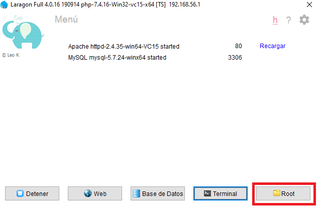

    

## **Nuestro Proyecto**

**NotifyBoard** es un servicio que trabaja con el framework de Laravel y consiste de un sistema de notificaciones. El software tiene la funcionalidad de enviar alertas de notificaciones para que el usuario pueda revisarlas. También proporciona la funcionalidad de tomar acción sobre estas notificaciones como aprobar, dejar pendiente o rechazarlas.

## **Planificación del proyecto: Landing Page**

Para el Landing Page se trabajó la planificación a través de un tablero de Kanban, el cual rescata todas las tareas asignadas a cada miembro del equipo y cada hito conluido. Se dividieron las tareas en varias partes como preparar el layout de la página, revisar y diseñar las secciones necesarias de la página y configurar la página para que sea responsive. 

## **Cronograma**

- Diseñar el layout general de la página (header, body footer, links)
- Diseñar la navegación, el footer, el header y el cuerpo de la página
- Acordar colores de estilo CSS e implementarlos en la página
- Diseñar la vista de login del usuario
- Diseñar la sección de funcionalidades
- Diseñar formulario de contacto
- Configurar la página para que sea responsive
- Adaptar imágenes a la página
- Creación del logo de NotifyBoard

## **Equipo y Responsabilidades**
Leticia Palazuelos | Scrum Master  | Diseño responsive, sección "Nuestro sistema, Adaptación de colores

Kevin Briceño         |  Developer     | Diseño layout, vista login, Footer

Ignacio Contreras     |  Developer     | Diseño sección "funcionalidades", sección "Contacto" 

Marcelo Carreño       |  Developer     | Diseño navegación principal , Adaptación imágenes del sitio , Desarrollo sección "Nosotros", logo

Hector Asencio        |  Developer     | Diseño header, sección "Tecnologías", sección "Contacto"

## **Demo del Landing Page NotifyBoard**
- [Link Heroku](http://mighty-taiga-25832.herokuapp.com)

## **Instrucciones de instalación**

- Descargar Laragon lite en url https://laragon.org/download/
- Instalar Laragon
- Verificar que tiene correctamente instalado Composer haciendo click en el botón "Terminal" de Laragon e ingresando el comando "composer". En caso de no reconocer Composer instalar.

    

- Descargar versión 7.4 de php en la siguiente url https://windows.php.net/downloads/releases/php-7.4.19-nts-Win32-vc15-x64.zip **Importante considerar qué versiones superiores no son compatibles con Laragon**
- Pegar carpeta de versión 7.4 php en carpeta C:\laragon\bin\php
- Asignar versión 7.4 de php en Laragon haciendo click derecho en el botón "root" de la interfaz de Laragon y seleccionando versión 7.4

    

- Clonar proyecto de github https://github.com/HectorAsencio/patagonia-landing.git en carpeta C:\laragon\www
- Iniciar servidor Laragon con botón "Iniciar todo" de la interfaz"

    

- Click derecho en botón "Web" de la interfaz de Laragon ->www/(nombre del proyecto)

    

