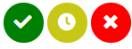
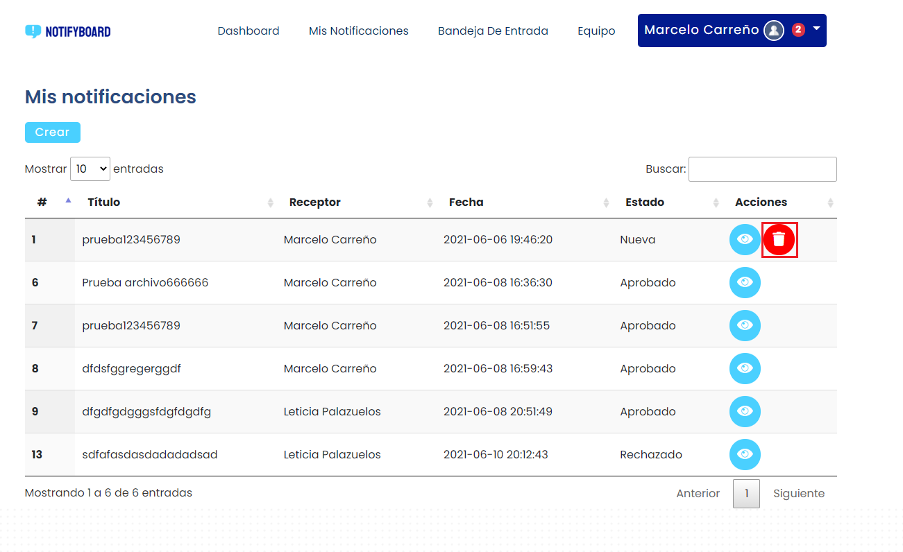
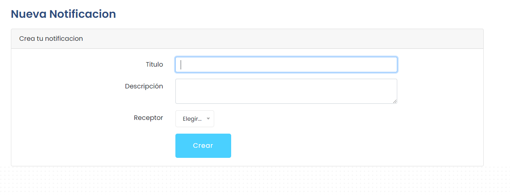
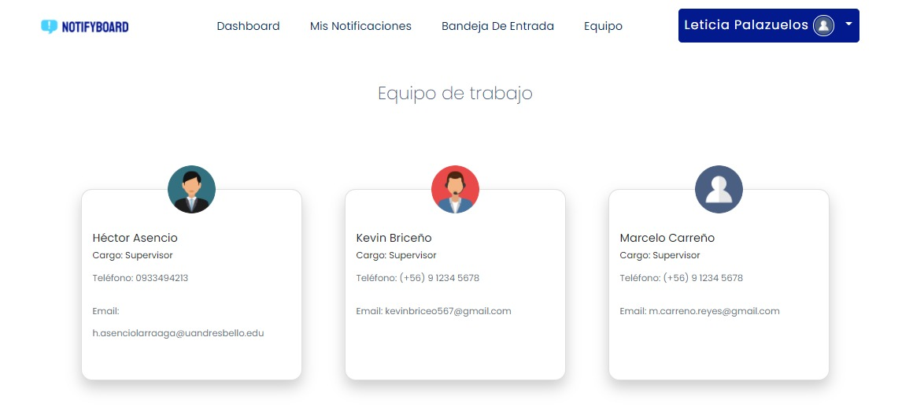
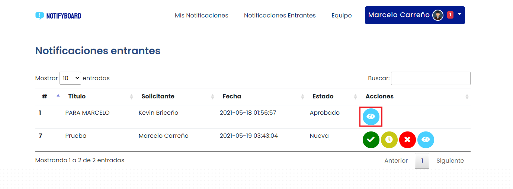
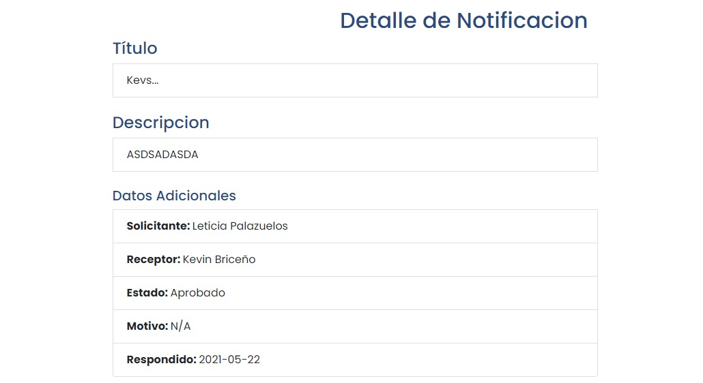
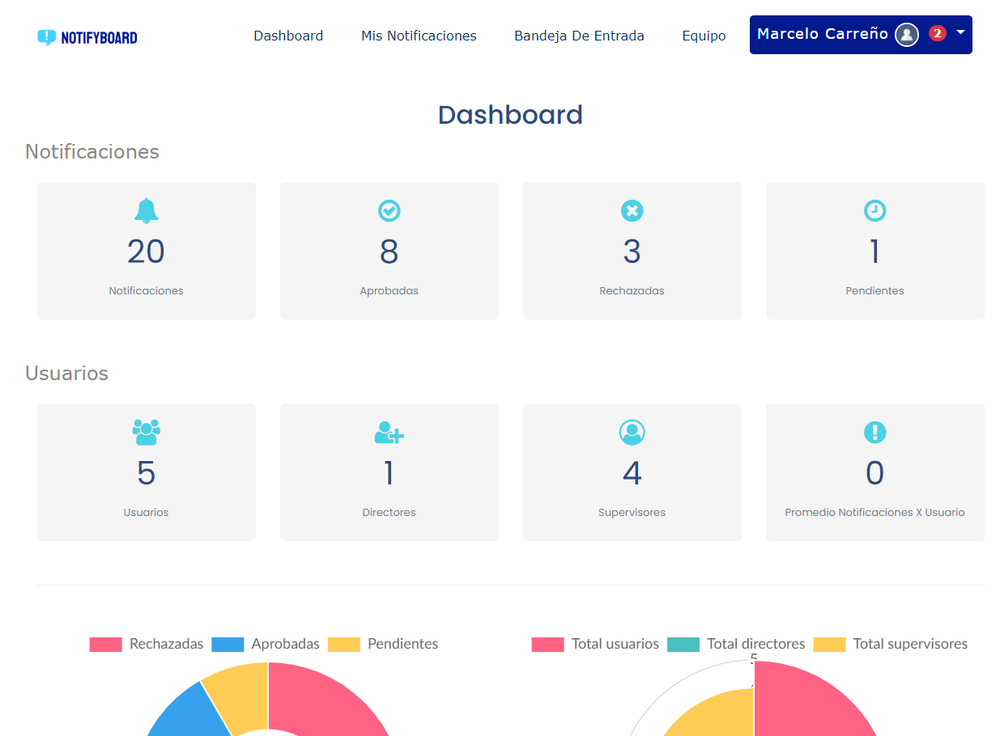
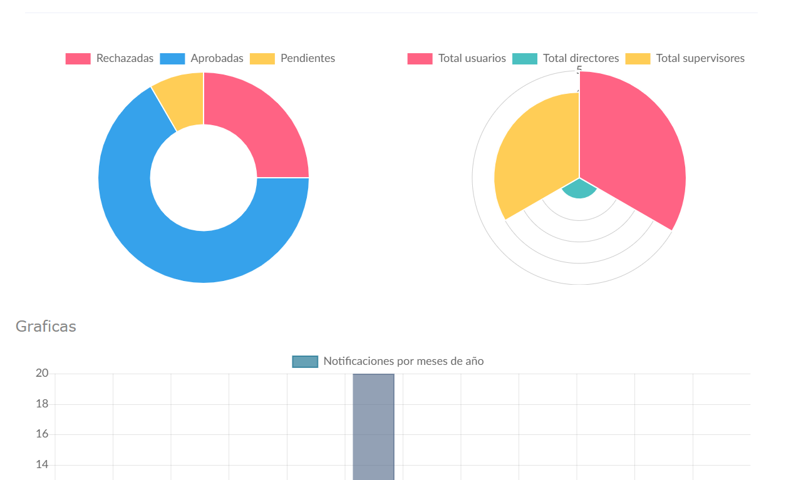

[README.MD](/README.md) > Manual de Usuario

    

## **
Manual de Usuario NotifyBoard
**

## **Nuestro Proyecto**

**NotifyBoard** es un servicio que trabaja con el framework de Laravel y consiste de un sistema de notificaciones. El software tiene la funcionalidad de enviar alertas de notificaciones para que el usuario pueda revisarlas. También proporciona la funcionalidad de tomar acción sobre estas notificaciones como aprobar, dejar pendiente o rechazarlas.

## **Contenidos**

- ¿Cómo iniciar sesión en Notifyboard?
- ¿Cómo aprobar , rechazar o dejar pendiente una notificación?
- ¿Cómo eliminar una notificación que he creado?
- ¿Cómo crear una notificación?
- ¿Cómo visualizar la información de mis integrantes de equipo?
- ¿Cómo ver el detalle de una notificación?
- ¿Cómo ver mi dashboard y que información contiene?

## **¿Cómo iniciar sesión en Notifyboard?**

Para iniciar sesión en Notifyboard debes acceder al home del sitio y clickear el botón en la esquina superior derecha que dice "Iniciar sesión".

Una vez dentro debes ingresar tus credenciales de usuario y presionar el botón "Iniciar sesión".

## **¿Cómo aprobar , rechazar o dejar pendiente una notificación?**
En la vista de sus notificaciones entrantes, podrá ver una lista que indica todas las notificaciones con sus respectivos datos. En este caso es importante ver que el estado de su notificación sea "Nueva", de esta manera tendrá habilitadas las acciones de "Aprobar", "Rechazar" o "Pendiente".

Los botones para realizar dicha acción son los siguientes:

Donde el botón verde es para aprobar, el botón amarillo es para dejar pendiente, y el botón rojo es para rechazar.

## **¿Cómo eliminar una notificación que he creado?**

En los comandos de usuario autenticado, debes ingresar a la pestaña "Mis notificaciones". Luego debes ver las notificaciones que has creado que únicamente están con el estado "Nueva", ya que las aprobadas, rechazadas y pendientes, no pueden ser alteradas una vez accionadas.

Luego serás redirigido a la pestaña "Mis notificaciones", donde podrás ver tus notificaciones actualizadas.

## **¿Cómo crear una notificación?**
En la pestaña de notificaciones debe hacer click en el botón "crear". Posterior a esto se abrirá un formulario que solicitará el título de la notificación, descripción y destinatario que aprobará.

Cada notificación debe tener un documento adjunto, el documento deberá estar en formato .pdf. El documento que subas podrá ser visualizado y descargado por el usuario que reciba la notificación.

## **¿Cómo visualizar la información de mis integrantes de equipo?**
Para visualizar la información de los integrantes de su equipo de trabajo, debe acceder al menú principal y hacer click en la pestaña "equipo". Luego se despliegará la información correspondiente al equipo de trabajo, nombres, cargos, correo y teléfono.

## **¿Cómo ver el detalle de una notificación?**
Para ver el detalle de una única notificación, debe hacer click en el botón celeste con forma de ojo en su lista principal de notificaciones. Este abrirá el detalle de una única notificación de su lista.

## **¿Cómo ver mi Dashboard y que información contiene?**

Para revisar el contenido del dashboard, debe dirigirse a la parte superior de la página y podrá ver un link que dice Dashboard. Al hacer click, este le redirigirá a la página de Dashboard. 

En esta página puede encontrar las notificaciones totales tanto suyas como las de todos los usuarios registrados. Estas están divididas en categorías como Aprobadas, Rechazadas o Pendientes. También encontrará gráficas que permiten ver la cantidad de usuarios registrados, la cantidad de notificaciones en cada categoría y la cantidad de notificaciones recibidas en cada mes. 

